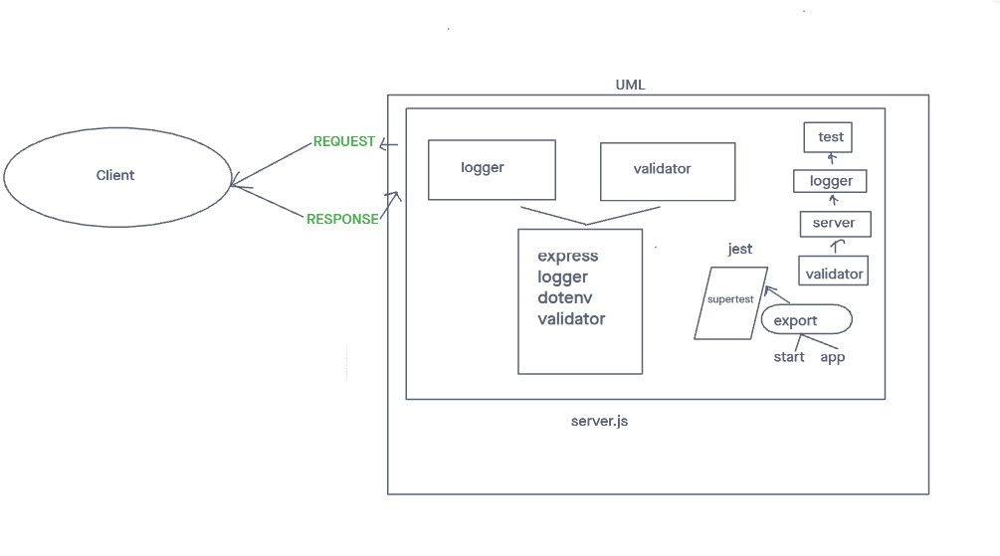

# Basic-Express-Server

## Author: Kao Saelor

## Collaborators
Collaborated with Kenya W., Hayden C. and Corianna W.

## Phase 1 Requirements

From a business requirements standpoint, we will be building a basic Express server using best practices, including server modularization, use of middleware, and tests.

### Person Route

- Method: GET

- Path: /person

  - Expects a query string from the user with a “name” property
  - When present, output JSON to the client with this shape: { name: "name provided" }
  - Without a name in the query string, force a “500” error

### Implementation Notes

Create an express server with the following proposed structure

```
├── .github
│   ├── workflows
│   │   └── node.yml
├── __tests__
│   ├── server.test.js (integration test)
├── src
│   ├── error-handlers
│   │   ├── 404.js
│   │   ├── 500.js
│   ├── middleware
│   │   ├── logger.js
│   │   ├── logger.test.js (unit test)
│   │   ├── validator.js
│   │   └── validator.test.js
│   └── server.js
├── .eslintrc.json
├── .gitignore
├── index.js
├── package.json
└── README.md
```

- `index.js` at the root of your repository, which will act as the “entry point” to your server.
  - should require `src/server.js`
  - should require `dotenv`, reading PORT from your `.env` file
  - It should call the `.start()` method from the server with the PORT set in your environment

- `src/server.js` which will serve as your server ‘module’ … will contain all of the module connections for the server
  - Must export an object with a `start()` method (it should not start on it’s own) and a reference to the express `app`

- Create a middleware folder and add 2 middleware modules to it:

  - `logger.js`

    - Performs a console.log with the request method and path
    - Import this into your server and set it up to run at the application level for all routes

  - `validator.js`
    - Checks the query string for a `name` property
    - Sends the request through when valid, forces an error when not

- Create a error-handlers folder and add 2 modules to it:

  - 404.js
    - Sends a 404/Not-Found message as the response
    - Import this into your server and set it up to be “used” after your other routes

  - 500.js
    - Sends a 500/Server Error message as the response
    - Import this into your server and set it up to be “used” as the last route

- Create the /person route within your `server.js`
  - This route should use the validator middleware to check the user’s input
  - If valid, send a JSON object through the response with the name value in it
i.e. {"name": "fred" }

### Testing Requirements

- Assert the following
  - 404 on a bad route
  - 404 on a bad method
  - 500 if no name in the query string
  - 200 if the name is in the query string
  - given an name in the query string, the output object is correct

**Engineering Note** - *Testing servers without side-effects is crucial. More critical is not having to manage starting/stopping a server in multiple environments.*

### Deployment

Your server must be deployed to the cloud. Please note the deployed URL in your README!

Render URL: <https://basic-express-server-vn0s.onrender.com/>

### UML


